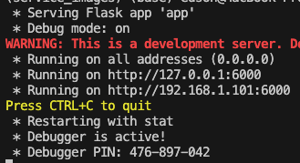

# Para executar

1. Instalação de pacotes:

É recomendável o uso de ambiente virtuais python como o venv ou anaconda. Caso não opte por esses recursos pode instalar diretamente na sua instalação de python. Para instalar entre na pasta app e execute o comando <code> pip install -r requirements.txt </code>.

1. Inicialização do serviço:

O primeiro passo é iniciar o servidor para que o mesmo fique escutando uma porta. Nessse serviço estamos usando a porta <i>6000</i>. 
Para iniciar o serviço na pasta app execute o comando <code> python app.py</code> uma mensagem semelhante a essa será apresentada. 

 

Nessa tela é apresentado os ips e portas que estão sendo usadas para escutar o serviço. Caso queira alterar a porta no arquivo <i>app.py</i> tem o parâmetro com o número da porta. 

1. Teste de envio:

Para testar o envio temos o arquivo <i>teste.ipynb</i> detalhando o envio, o serviço espera 03 parâmetros:
* image: a imagem em base64 (semelhante ao que é feito na ESP32)
* id: um número para identificação da ESP32
* name: Nome do arquivo que será gravado 

Esses 03 parâmetros são passados via <i>json</i> (<code>{"image": "/9j/4AAQSkZJR......gABAQEAAAAAAADKQH/2Q==", "id": "01", "name": "2024-09-10 11:29:04"}</code>) para o serviço que os processa e gravar o arquivo na pasta <i>images</i>. A pasta <i>data</i> contém uma imagem de exemplo para envio. 

